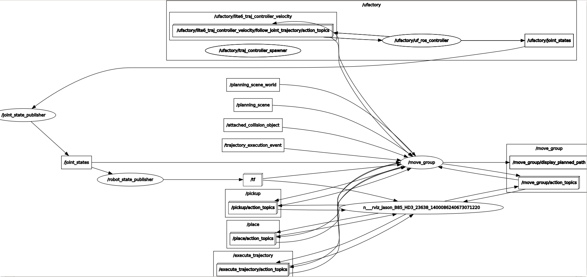

For Chinese version: [简体中文版说明](#重要说明)

# Important Notice:
This ReadMe is for new(Lite 6 and UF850) and future UFACTORY product models other than xArm series. Here use "lite6" as example, for UFACTORY 850 users, please change "**lite6**" to "**uf850**" accordingly.  

If you have used "xarm_ros" for xArm series before, the main differences for new UFACTROY models are:  

* Default namespace has changed from `xarm` to `ufactory`;  

* Robot full-state report topic name has changed from `xarm_states` to `robot_states`;   


# 1. Simulations

## 1.1 Simple Rviz visualization:  
```bash
$ roslaunch xarm_description lite6_rviz_display.launch
```
The robot model will appear in Rviz window and "joint state publisher" panel can be used to adjust the posture of that robot.  


## 1.2 Load robot model in Gazebo environment:
```bash
$ roslaunch xarm_gazebo lite6_beside_table.launch [add_gripper:=true] [add_vacuum_gripper:=true] 
```
Gazebo will be launched and virtual robot will be mounted on a table, `add_gripper` and `add_vacuum_gripper` are optional arguments. However, only one end tool should be installed.  

## 1.3 Moveit simulation:

Please refer to [uf_robot_moveit_config](uf_robot_moveit_config/Readme.md) package.   
  

# 2. Controlling Real Robot

# 2.1 ROS service control:
First bring up the UFACTORY ros driver:
```bash
$ roslaunch xarm_bringup lite6_server.launch robot_ip:=192.168.1.xxx (your robot IP)
```
Then, please refer to [xarm_api/xarm_msgs part](https://github.com/xArm-Developer/xarm_ros#57-xarm_apixarm_msgs), the concepts, provided services or messages are all the same except the **default namespace for non-xArm series** is `ufactory` rather than `xarm`. For example, to call the service of enabling all joints:
```bash
$ rosservice call /ufactory/motion_ctrl 8 1
```
All the xArm services (joint/cartesian motion, velocity motion, servo motions, etc) including [mode operations](https://github.com/xArm-Developer/xarm_ros#6-mode-change) can be directly used on new models like Lite 6, just replace previous namespace `/xarm` with `/ufactory`. 

Another difference from xArm version is the topic **`/xarm/xarm_states`** has been changed to **`/ufactory/robot_states`** (with default namespace attached).

# 2.2 Moveit control:

Please refer to [uf_robot_moveit_config](uf_robot_moveit_config/Readme.md) package.    

Below is the network diagram from `rqt_graph` output:  
  

 


# 重要说明:

这篇ReadMe适用于UFACTORY xArm系列之外的产品(如Lite 6, UF850)，本说明使用 "lite6" 作为例子，使用UFACTORY 850的用户，请将"**lite6**"关键字替换为"**uf850**"。  

如果您之前已经使用过 "xarm_ros" 开发 xArm 系列产品, 对于UFACTORY其他系列的ros开发，方法和操作大同小异，主要的区别在于:  

* 默认的命名空间从 `xarm` 更改为 `ufactory`;  

* 机械臂全状态反馈的话题(topic) 名称由 `xarm_states` 更改为 `robot_states`;   


# 1. 仿真

## 1.1 简单的Rviz可视化:  
```bash
$ roslaunch xarm_description lite6_rviz_display.launch
```
运行之后，机械臂的模型会出现在Rviz界面中，"joint state publisher" 面板可以用来调整手臂的位姿。  


## 1.2 Gazebo环境中加载仿真模型:
```bash
$ roslaunch xarm_gazebo lite6_beside_table.launch [add_gripper:=true] [add_vacuum_gripper:=true] 
```
Gazebo启动后, 虚拟机械臂会放置在桌子边沿位置，`add_gripper` 和 `add_vacuum_gripper` 是另外的可选参数，可以根据需要给定`true`来加载UFACTORY官方的夹爪或吸头的配件模型，注意只能加载一款末端执行器。  

## 1.3 Moveit规划仿真:

请参考[uf_robot_moveit_config](uf_robot_moveit_config/Readme_cn.md)   
   

# 2. 控制真实机械臂

# 2.1 ROS service 控制:
首先启动 UFACTORY ROS 驱动:
```bash
$ roslaunch xarm_bringup lite6_server.launch robot_ip:=192.168.1.xxx (your robot IP)
```
然后，请认真阅读和参考[xarm_api/xarm_msgs 部分](https://github.com/xArm-Developer/xarm_ros/blob/master/ReadMe_cn.md#57-xarm_apixarm_msgs), 其中的概念、提供的服务和定义的消息类型都是和xarm一致的，除了默认的命名空间是 `ufactory` 而不是 `xarm`。举例来说，对于非xArm系列如Lite6手臂，调用全部关节使能服务的方法为:
```bash
$ rosservice call /ufactory/motion_ctrl 8 1
```
所有xArm适用的服务(关节/笛卡尔运动, 速度模式运动, servo运动等等)以及 [模式操作](https://github.com/xArm-Developer/xarm_ros/blob/master/ReadMe_cn.md#6-%E6%A8%A1%E5%BC%8F%E5%88%87%E6%8D%A2)都可以使用在Lite 6 型号中, 调用方法很简单，将之前说明中的`/xarm`命名空间替换为`/ufactory`就好。 

另一个值得注意的变化是xArm系列使用的话题 **`/xarm/xarm_states`** 被修改为 **`/ufactory/robot_states`** (已带上默认命名空间)。

# 2.2 Moveit 规划控制:

请参考[uf_robot_moveit_config](uf_robot_moveit_config/Readme_cn.md)   

下图是来自`rqt_graph`输出的网络结构示意图:  

 