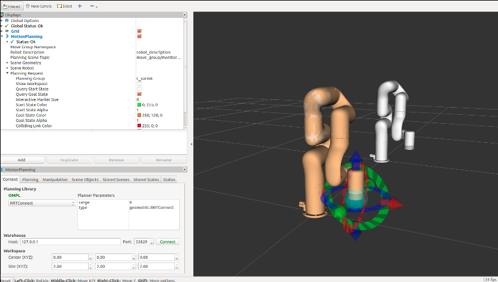
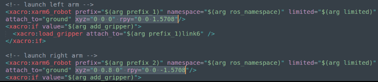
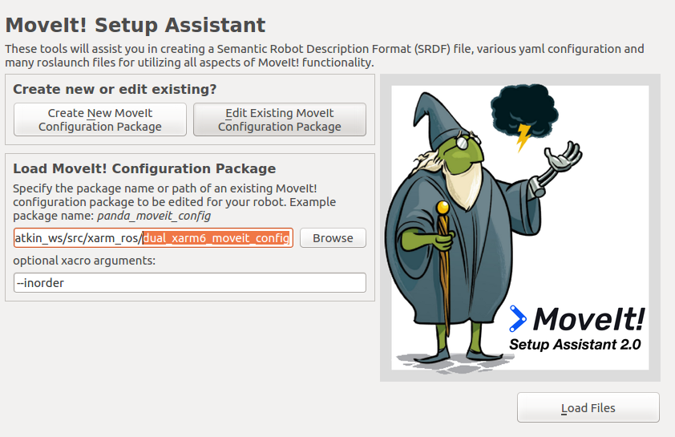
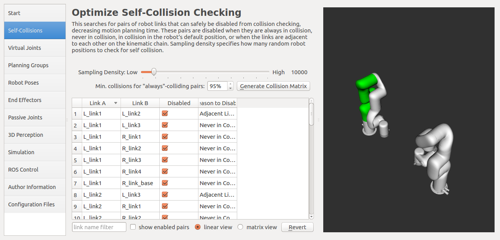
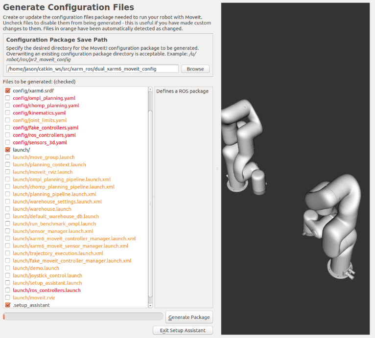
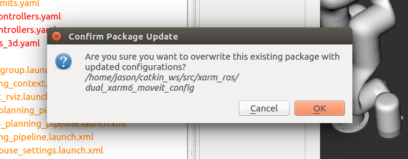
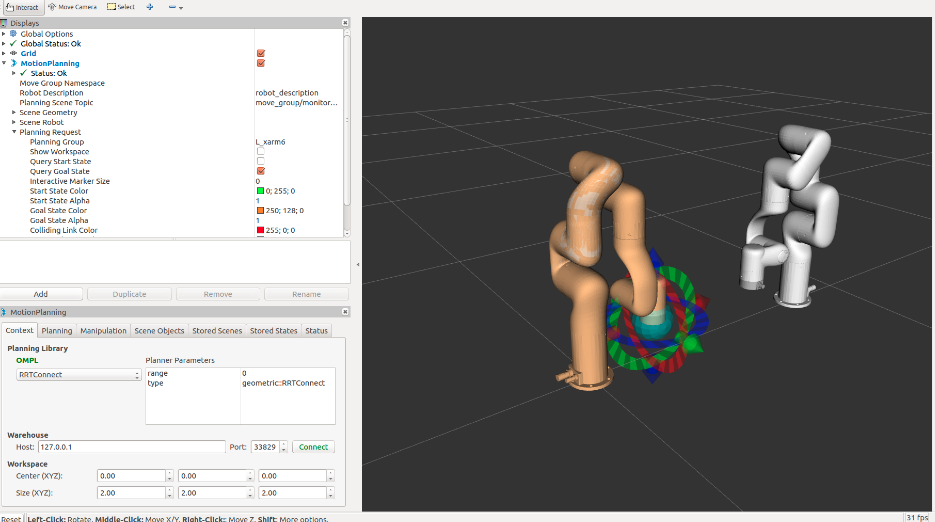

# 1. multi_xarm5 (controlled separately)
This package might give you a hint about how to launch and control two or more xArms (same model), while avoiding name clashes. Here xArm5 is used as an example, you can edit the launch files to control xarm6 or xarm7.      

(1) For a simulation, run:
```bash
$ roslaunch multi_xarm5 two_sim_xarm5.launch ns:=/uf
```
As an example, this command will bring up 2 xArm5 simulation models in 2 separate Moveit-RViz application windows. You can see in 'rqt_graph' that they come with 2 namespaces, one is '/uf' and the other is '/uf_2', and they can be controlled independently.  

(2) Or if two real xArm5 are available, try:
```bash
$ roslaunch multi_xarm5 two_real_xarm5.launch ns_1:=/left robot_ip_1:=192.168.1.212 ns_2:=/right robot_ip_2:=192.168.1.233
```
The IP addresses are just for examples here, if properly launched, you can control 2 real xarm5 in two separate Moveit-RViz windows independently.  

# 2. Servo_Cartesian (streamed Cartesian trajectory)

**PLEASE NOTE:** If you are already using **Moveit** to control the real robot arm, move_servoj and move_servo_cart **can not be used concurrently**, since they use the same mode(1) to control and may interfere with each other!  

Now with xArm controller **Firmware Version >= 1.4.1**, user can send streamed Cartesian poses to continuously control the xArm, through ros service, this is a wrap of the same xarm sdk(api) function. The actual speed depends on the sending frequency and step distance. Users are encouraged to send the path points in a fixed frequency(20Hz~100Hz) and step distance(**MUST** <10mm).   
(1) To start, bring up the xarm server. [use xArm 7 as example]
```bash
$  roslaunch xarm_bringup xarm7_server.launch robot_ip:=192.168.1.233
```
(2) In another terminal, do initial configurations, servo cartesian has to operate in **Mode 1**:
```bash
$ rosservice call /xarm/motion_ctrl 8 1
$ rosservice call /xarm/set_mode 1
$ rosservice call /xarm/set_state 0
```
(3) Call the servo_cartesian service. Please note:  
**(1) the Cartesian pose representation is the same with xarm SDK here. which is [X(mm), Y(mm), Z(mm), Roll(rad), Pitch(rad), Yaw(rad)]**  
**(2) the path must start from current tool center point(TCP) position and the command can not be too far away, or the execution will fail or act strange. PLEASE CHECK the correctness of command before sending it.**  
**(3) service argument format is like: "pose: [214, 0, 121, 3.1416, 0, 0]	mvvelo: 0.0	mvacc: 0.0	mvtime: 0.0	mvradii: 0.0"**    
**(4) For Base Coordinate motion, the arguments mvvelo, mvacc, mvtime, and mvradii are not effective now, so just give them all 0.**  
  
Suppose current TCP position is at [206, 0, 121, 3.1416, 0, 0]
```bash
$ rosservice call /xarm/move_servo_cart [210,0,121,3.1416,0,0] 0.0 0.0 0.0 0.0
```
Now please check the current TCP position, it will execute this target immediately if success. If you want continuous motion alone X axis, you can give the following pose like:
```bash
$ rosservice call /xarm/move_servo_cart [214,0,121,3.1416,0,0] 0.0 0.0 0.0 0.0
```
And you can program this service calling procedure in a loop with proper intervals inbetween, the final execution will become smooth.   

**Notice: Servo_cartisian in TOOL coordinate:**
Please update the controller Firmware to version >= 1.5.0. If servo_cartesian in Tool Coordinate is needed, **put 1 to the previous "mvtime" argument**, the resulted motion will base on current Tool coordinate. For example:  
```bash
$ rosservice call /xarm/move_servo_cart [0,0,2,0,0,0] 0.0 0.0 1 0.0
```
This will make tool to move 2 mm immediately along +Z Axis in **TOOL Coordinate**.  
There is also **example code** implementing continuous servo_cartesian() in tool coordinate: [c++ version](../xarm_api/test/servo_cartesian_test.cpp) and [python version](../xarm_api/scripts/servo_cartesian_test.py).


# 3. Servo_Joint (streamed joint-space trajectory)
There is also a similar service called "**/xarm/move_servoj**", you can use this service to control joint motion in the **same mode (1)** with Servo_Cartesian. It receives **absolute** joint positions as command.  Before calling it, please check the current joint position in "/xarm/joint_states" topic, and increase the target joint position **little by little** just like calling /xarm/move_servo_cart.

For example, if /xarm/joint_state says current joint positions are:  [0.25,-0.47,0.0,-0.28,0.0,0.76,0.24], you can call:  
```bash
$ rosservice call /xarm/move_servoj [0.25,-0.47,0.0,-0.28,0.0,0.76,0.25] 0.0 0.0 0.0 0.0
```
Which will move joint7 by 0.01 rad **immediately**. Keep calling it and increase the joint positions a small step each time, it will move smoothly. **Be careful not to give a target too far away in one single update**.  

# 4. Dual xArm6 controlled with one moveGroup node:
Unlike example 1, This example will bring up only one Rviz and move_group node to control 2 xArm6 arms, which can be used for a dual-arm application.  
To launch the application, run the following with your correct xArm controller IP addresses: 
```bash
$ roslaunch dual_xarm6_moveit_config realMove_exec.launch robot_ip_1:=192.168.1.xxx robot_ip_2:=192.168.1.xxx
```  
 
If successfully launched, you will see two xArm6 separated by 1 meter, their relative position to each other can be re-configured in /xarm_description/urdf/dual_xarm6_robot.urdf.xacro, just edit the "xyz" and "rpy" values. You may also add your base to hold the two arms.  

For example, to make the two arms stand face-to-face:  
 

1. After Modification to the correct configuration, please run moveit_setup_assistant again to update the collision matrix.
```bash
$ roslaunch moveit_setup_assistant setup_assistant.launch 
```  
2. Click "Edit Existing Moveit Configuration Package" and browse to navigate to the location of "dual_xarm6_moveit_config" package:    
 

3. Then click "Load Files". You can see the robot location has already been changed face-to-face.   
 

4. Go to first tag "Self-Collisions" and click on "Generate Collision Matrix" to update the Self-collision information.  
 

5. Then **Skip the rest and go straight to the last tag** "Configuration files", since other settings are already taken care of and can not be over-written. Watch out for the choices! **ONLY** leave the "config/","config/xarm6.srdf", "launch/" and ".setup_assistant" checked, and others unchecked! Such that only the collision matrix will be updated this time. **If other files checked and overwritten by setup assistant, driving of the real arms may be affected**.
 

6. Make sure the above step is correct and click "Generate Package" and "OK" if asked for confirmation. Then the reconfiguration of your own dual-arm is done. 
 

7. You can first check in simulation by: 
```bash
$ roslaunch dual_xarm6_moveit_config demo.launch
```
 

8. If everything looks OK, you can move on to control the real dual-arm:
```bash
$ roslaunch dual_xarm6_moveit_config realMove_exec.launch robot_ip_1:=192.168.1.xxx robot_ip_2:=192.168.1.xxx
```  

# 5. Run Recorded Trajectory (Beta):
To record a new trajectory (no longer than 5 min):
```bash
$ rosservice call /xarm/set_state 0 (DO NOT set STOP state(4) during recording or saving process)

$ rosservice call /xarm/set_recording  1 (to start recording trajectory)
...
$ rosservice call /xarm/set_recording  0 (to finish recording trajectory)

$ rosservice call /xarm/save_traj 'my_recording.traj' (give your desired name with the suffix '.traj')
```   
To run a saved trajectory:
```bash
$ rosservice call /xarm/set_mode 0
$ rosservice call /xarm/set_state 0
$ rosservice call /xarm/play_traj 'my_recording.traj' 1 (repeat times)  1 (speed-up factor: 1x,2x or 4x speed)
``` 