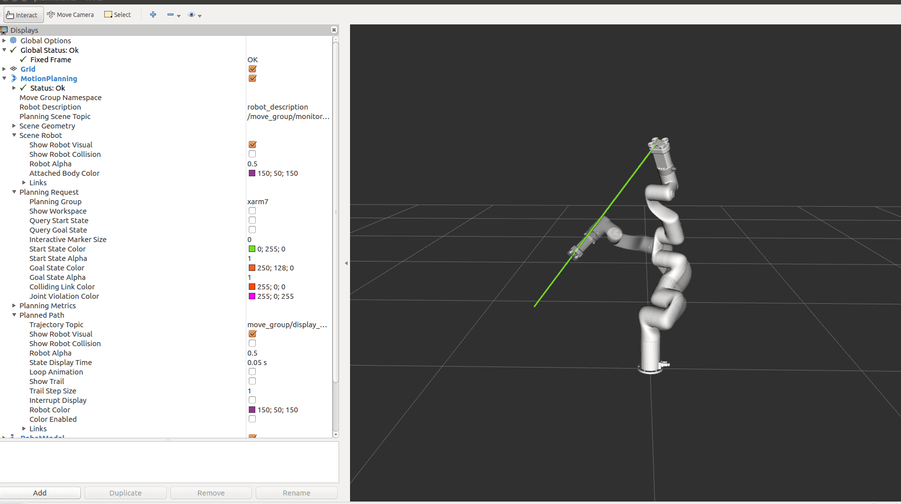

# Package Introduction
&ensp;&ensp;This package is intended to provide users a demo programming interface to use moveit!, instead of just using the GUI. To use the API better, users are encouraged to go through [Moveit tutorial](http://docs.ros.org/kinetic/api/moveit_tutorials/html/).  
&ensp;&ensp;Inside the package, 'xarm_simple_planner' is just a basic implementation of the Move_group interface, if higher level configurations (constraints, switch kinematic solver or planners, etc) are needed, user can fully explore Moveit abilities and implement a sofisticated version.  
&ensp;&ensp;For simplified Chinese instructions: [简体中文版](./ReadMe_cn.md)    

# Usage
## Launch the simple planner node:
If you want to try it in simulation, run:
```bash
   $ roslaunch xarm_planner xarm_planner_rviz_sim.launch robot_dof:=<7|6|5> robot_type:=<xarm|lite>  add_gripper:=<true|false> add_vacuum_gripper:=<true|false>
```
Or, if you would work with real xArm, run:  
```bash
   $ roslaunch xarm_planner xarm_planner_realHW.launch robot_ip:=<your controller box LAN IP address> robot_dof:=<7|6|5> robot_type:=<xarm|lite> add_gripper:=<true|false> add_vacuum_gripper:=<true|false>
```
Argument 'robot_dof' specifies the number of joints of your xArm (default is 7). 'add_gripper' and 'add_vacuum_gripper' are for the cases with UF end-effector attached, only one end-effector can be attached.   

This node can provide services for planning request in Cartesian target and joint space target. Service definition can be found in srv folder. User can call the services to let planner solve the path to specified target point, and retrieve the boolean result as successful or not. Once the node is launched, user can try in command-line first, something like:  

## For joint-space planning request:  
```bash
   $ rosservice call xarm_joint_plan 'target: [1.0, -0.5, 0.0, -0.3, 0.0, 0.0, 0.5]'
```
The target elements in this case correspond to each joint target angle in radians, number of elements is same with the DOF.  

## For Cartesian-space point-to-point planning request:  
```bash
   $ rosservice call xarm_pose_plan 'target: [[0.28, 0.2, 0.2], [1.0, 0.0, 0.0, 0.0]]'
```
The separated fields for Cartesian target correspond to tool frame position (x, y, z) in ***meters*** and orientation ***Quaternions*** (x, y, z, w).  
Note that this motion is still point-to-point, meaning the trajectory is NOT a straight line.  

## For Cartesian straight line planning request:
```bash
   $ rosservice call xarm_straight_plan 'target: [[0.28, 0.2, 0.2], [1.0, 0.0, 0.0, 0.0]]'
```
Command data units are the same with above Cartesian pose command. If planned succesfully, end-effector trajectory will be a straight-line in space. Note that the velocity change may not be as expected during execution. Please refer to MoveGroupInterface documentation to make your modifications to the code if necessary.  

After calling the above planning services, a boolean result named 'success' will be returned.  

### Quaternion calculation tips:
If you are not familiar with conversion from (roll, pitch, yaw) to quaternions, refer to [this page](http://wiki.ros.org/tf2/Tutorials/Quaternions#Think_in_RPY_then_convert_to_quaternion).

## For Execution of planned trajectory:  

***Notice: Use Cartesian planning with special care, since trajectory from Moveit (OMPL) planner can be highly random and not necessarily the optimal (closest) solution, Do check it in Rviz befroe confirm to move!*** 

If solution exists and user want to execute it on the robot, it can be done by  service call (**recommended**) or topic message. 

### Execute by service call (Blocking)
Call the 'xarm_exec_plan' service with a request data of 'true', the latest planned path will be executed, the service will return after finishing the execution:  
```bash
   $ rosservice call xarm_exec_plan 'true'
```

### Execute by topic (Non-blocking)
Just publish a message (type: std_msgs/Bool) to the topic "/xarm_planner_exec", the boolean data should be 'true' to launch the execution, it returns immediately and does not wait for finish:  
```bash
   $ rostopic pub -1 /xarm_planner_exec std_msgs/Bool 'true'
```

Alternative way of calling services or publish messages, is to do it programatically. User can refer to ROS [tutorial1](http://wiki.ros.org/ROS/Tutorials/WritingServiceClient%28c%2B%2B%29) and [tutorial2](http://wiki.ros.org/ROS/Tutorials/WritingPublisherSubscriber%28c%2B%2B%29) to find out how to do it, or refer to the 'xarm_simple_planner_test.cpp' in the src folder as an example.  
To run the test program ( ***for xArm7 only***, user can modify the command list for other models), after launching the simple planner:
```bash
   $ rosrun xarm_planner xarm_simple_planner_test
```
The program will execute three hard-coded joint space target, ***MAKE SURE THERE ARE PLENTY SURROUNDING SPACES BEFORE EXECUTING THIS!***

### Visualization of planned trajectory
Refer to issue [#57](https://github.com/xArm-Developer/xarm_ros/issues/57), now xArm and end-effector descriptions are re-configured to enable the visualization of TCP trajectory upon successful planning. As is shown below:   


